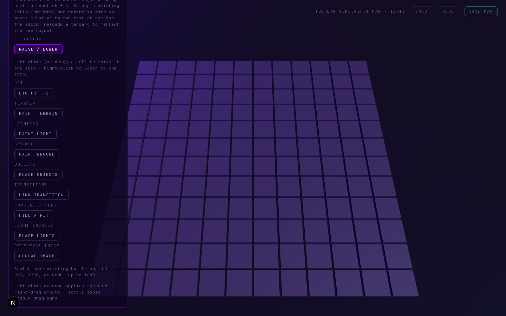
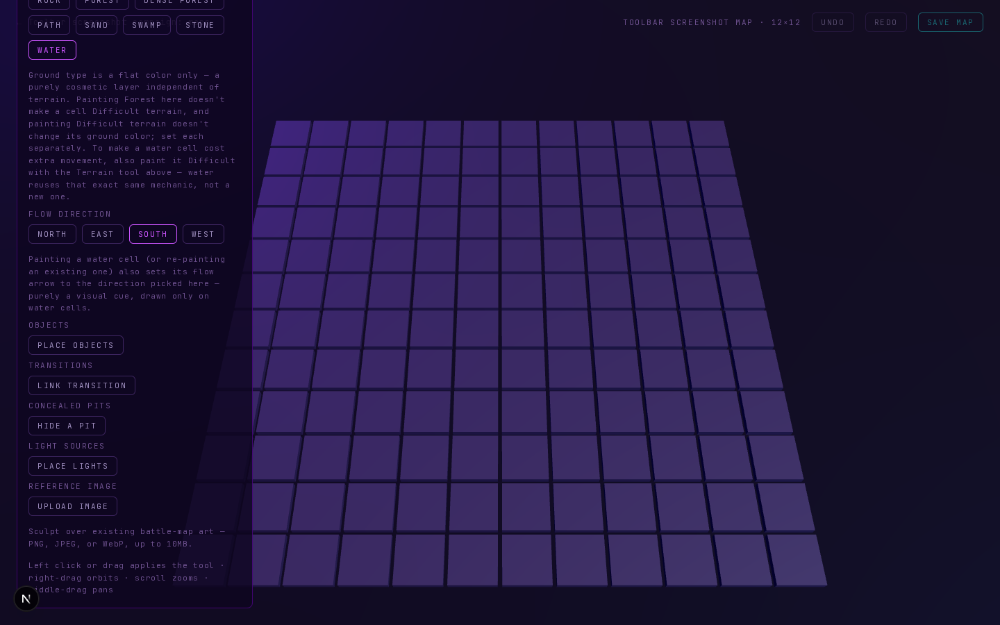
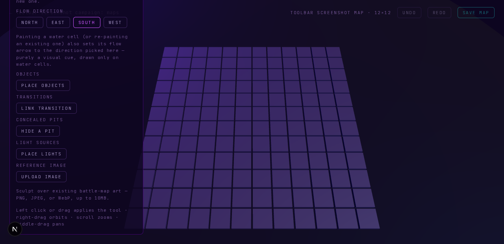
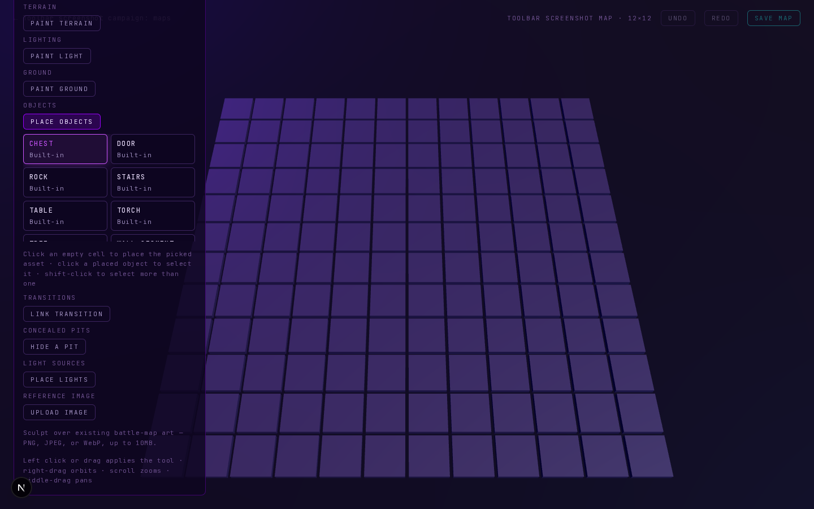

# Design spike: map editor toolbar redesign

Status: design only — no toolbar code shipped by this document (one
throwaway screenshot script was written, run, and deleted; the screenshots
it produced are committed as evidence and referenced below). Written to be
built by the follow-up prompt(s) scoped in §9.

## 1. Problem recap

The project owner's own words: *"i think the tool bar shoukd be redesigned
and more thought out with the floe of map making, i currently feels like
each section is bolted on, can you makw a proper ui now for this?"* — asked
immediately after requesting 5 specific QoL features for the map editor:

1. Real drag-marquee select for map objects (replacing/supplementing
   shift-click accumulation).
2. An eyedropper tool (pick a cell's terrain/ground/elevation as the active
   brush).
3. Area-fill for ground/terrain (paint a whole selected rectangle at once).
4. Number-key tool shortcuts (1–9).
5. A fix for a real toolbar overflow bug (the Ground tool's panel can push
   earlier buttons off-screen on a short viewport with no way to scroll back).

The ask is explicit: don't bolt these 5 features onto the existing
structure as five more sections — rethink the toolbar's information
architecture around how map-making actually flows, and make the 5 features
first-class citizens of that structure.

## 2. What was read

Full files: `src/app/campaigns/[id]/maps/[mapId]/edit/MapEditor.tsx` (2,816
lines, in full — every tool, every conditional sub-panel), `.../lib/cellGrid.ts`
(the `EditorTool` union, `applyTool`, `CellState`, `buildDenseCells`,
`rowsForSave`), `.../editor.module.css` (the toolbar's actual CSS),
`src/scene-3d/MapEditorScene.tsx` (the pointer-event model: `handleDown`/
`handleOver`/the per-stroke dedupe/the region-drag mechanic that already
powers the AI-generate tool's rectangle selection), `src/ui-components/`
(`Button.tsx`, `Badge.tsx`, `Panel.tsx`, `SectionHeader.tsx`, `ChoiceCard.tsx`
— what's actually available to build with), `docs/design/pits-and-falling.md`
and `docs/design/model-orientation-and-posing.md` (the two prior design-spike
precedents this document follows the shape of), and
`Claude_Code_Prompts_MapEditorExtensions_2026-08-26.md` (the scope-review doc
that produced the map editor's whole `MapPlan` prompt sequence — the
established "decisions locked in / sequencing / dependency chain" convention
this document's own §9 follows). Cross-checked `scripts/db/verify-*.mjs` (60
scripts total) for which ones exercise map-editor toolbar `data-testid`s, to
size §8's verify-script impact from evidence rather than a guess. Also wrote,
ran, and then deleted a throwaway Playwright screenshot script (see §3) —
this document ships no other code. Re-ran `git merge master` twice — once at
the start of this spike and once immediately before committing it —
specifically to catch MapPlan P3 (wall corner/diagonal geometry), which was
reported as concurrently in flight.

**MapPlan P3 status at the time of writing:** not yet landed on `master` as
of either merge (confirmed by `git log` and by `grep -ri wall` across
`src/`, which finds only rendering-code comments about a pit's "visible
walls," not a wall tool or wall asset special-casing). Per P3's own scope
(`Claude_Code_Prompts_MapEditorExtensions_2026-08-26.md` §"Prompt 3"), its
likely shape is: (a) a geometry/sizing fix to `PlacedObject.tsx` so the
existing Wall Segment preset asset renders edge-to-edge, (b) a new corner
wall asset wired into `templates.ts`'s `wallRotation`, and (c) **possibly**
loosening the Object tool's rotate control from fixed-90° to arbitrary
degrees for diagonal placement — none of which was written up as "a new
toolbar section." §5.1's Place mode already accommodates whatever P3 lands
as (new preset assets need zero toolbar changes; a freer-rotation control is
a small addition inside the existing object-selected sub-panel). If P3 turns
out to add a genuinely new top-level tool/mode instead, that's flagged as an
open question at the end of this document.

## 3. Real screenshots of the current toolbar

Captured with a throwaway Playwright script (`scripts/db/_scratch-toolbar-screenshots.mjs`,
written for this spike and deleted before committing, per this task's own
instructions) against a fresh 12×12 map with no cells painted, so every
visible pixel is the toolbar's own default chrome, not map content
obscuring it.

**01 — default state, 1440×900, Elevation tool selected (today's default):**



Even in the *simplest* possible state (nothing painted, no sub-panel other
than Elevation's one-line hint expanded), the grid-growth hint text at the
very top is already clipped by the top of a 900px-tall viewport. This is
the toolbar's natural content height exceeding a common laptop screen height
*before* a single brush panel is even open.

**02 — Ground tool, Water brush selected (the flow-direction row expanded), still 1440×900:**



**03 — the identical state at a 1280×620 viewport** (a realistic "laptop
browser window with devtools or an OS taskbar taking vertical space" size):



This is the exact reported bug, reproduced and measured, not just
described. A direct DOM probe taken in the same run confirms *why* there is
no scrollbar:

```
scroll probe on the short viewport:
{"found":true,"before":0,"after":0,"overflowY":"visible","scrollHeight":1495,"clientHeight":1495}
```

Setting `toolbar.scrollTop = 9999` has zero effect (`before === after === 0`)
because `scrollHeight === clientHeight` (1495px both) — the element isn't
clipped at all; `.toolbar`'s CSS (`editor.module.css:60–72`) is
`position: absolute; left: 24px; bottom: 24px;` with **no `max-height` and
no `overflow-y`**, so the box simply grows to its full natural height and
extends upward past `y = 0` with nothing to clip it and nothing to scroll.
Every element above the fold is not just visually cut off — it's genuinely
unreachable by any input the browser offers.

**04 — Object tool, showing the one place a scroll container already exists:**



`.assetGrid` (`editor.module.css:88–95`) *does* have `max-height: 190px` +
`overflow-y: auto` — proving the codebase already knows how to build a
scrolling panel, just never applied that pattern to the toolbar's outer
container. This screenshot is also cut off at the top for the same reason
as shots 02/03.

## 4. Diagnosis: what specifically makes this feel "bolted on"

This isn't a vague impression — four distinct, independently-citable
problems, each with its own root cause:

### 4.1 One flat list, zero grouping, in pure historical-insertion order

The entire toolbar is 977 lines of JSX (`MapEditor.tsx:1837–2813`) inside a
single `<div className={styles.toolbar}>` with **no nested grouping
container anywhere in it** — every one of its 14 `styles.toolbarLabel`
section headers (AI draft, Grid size, Elevation, Pit, Terrain, Lighting,
Ground, Flow direction, Objects, Transitions, Concealed pits, Light
sources, AI, Reference image) is a **direct sibling** of every other, each
followed by its own `<div className={styles.toolRow}>` — visually and
structurally identical regardless of what kind of thing it actually is.

The order is not workflow order (elevation/pit sculpting is followed
immediately by paint tools, which is right — but Transitions and Concealed
Pits, two "where does this cell secretly lead" features, are separated by
the entire Objects section, and Light *sources* (placed things with a
radius) sit far from Light *level* (a per-cell brush) despite sharing the
word "light"). It's not alphabetical either. It matches, almost exactly,
the order each feature was merged into the codebase (elevation/terrain
first, then ground types, then pits, then water, then concealed pits, then
light sources — cross-checked against `git log --oneline`). That is the
literal meaning of "bolted on": each new prompt's only job was to append one
more label+button pair to the bottom of an ever-growing list, because
nothing about the container gave it anywhere else to go.

### 4.2 No visual distinction between three genuinely different kinds of control

Three different *kinds* of thing are rendered identically:

- **Persistent tool selection** (radio-button-like: exactly one of
  Elevation/Pit/Terrain/Light/Ground/Object/Transition/Concealed-pit/
  Light-source/Generate is active at a time) — 10 buttons.
- **One-off actions** (fire-and-forget: Save map, Grow, Rotate 90°, Accept/
  Discard, Create link, Hide pit here, Place light, Upload/Replace image).
- **Context-dependent forms/sub-panels** that appear and disappear based on
  the active tool (brush rows, the water flow-direction row, the asset
  grid + selected-object controls, the transition form, the concealed-pit
  form, the light-source form, the generate prompt panel).

All three render as the same `<Button size="sm">` inside the same
`toolRow`/`toolbarLabel` scaffolding. A first-time user has no visual cue
that clicking "Paint terrain" *changes what the canvas does on click*, while
clicking "Rotate 90°" *does something to the selected object right now and
stays on the same tool* — both just look like buttons in a list.

### 4.3 The button color system has no consistent meaning — verified, not assumed

`Button.tsx` exposes exactly 5 `variant`s (`primary`, `accent`, `teal`,
`danger`, `ghost`). Reading every tool-select button's `variant` prop
directly (`MapEditor.tsx`, cross-referenced by line number):

| Tool button | Selected variant |
|---|---|
| `tool-elevation` (1930) | `primary` |
| `tool-pit` (1946) | `primary` |
| `tool-terrain` (1968) | **`accent`** |
| `tool-light` (2014) | **`accent`** |
| `tool-ground` (2053) | **`accent`** |
| `tool-object` (2114) | `primary` |
| `tool-transition` (2250) | `primary` |
| `tool-concealed-pit` (2360) | `primary` |
| `tool-light-source` (2453) | `primary` |
| `tool-generate` (2642) | `primary` |

Seven of ten top-level tool buttons use `primary` for "this tool is
selected"; three (Terrain, Light, Ground — coincidentally or not, the three
oldest paint tools) use `accent` for the exact same semantic. There is no
functional difference intended — this is simply three call sites written at
different times reaching for a different, equally-plausible color.

It compounds: every **brush** button (Difficult/Normal/Void, Bright/Dim/
Dark, the 10 ground types, the 4 water-flow directions) *also* uses
`accent` for "selected" — the identical color Terrain/Light/Ground use for
"this is the active tool." A user looking at the Ground section when Ground
is active sees the tool button and the brush button rendered in the *same*
accent purple with no visual distinction between "you are in ground-painting
mode" and "grass is the currently-loaded brush" — two different facts,
rendered identically, right next to each other.

`teal` is reserved for "commits/submits a change" (Save map, Accept, Create
link, Hide pit here, Place light, Rotate 90°, Grow, Replace image) — the one
genuinely consistent convention in the file. `danger` is consistently
"destructive" (Discard, Remove ×5, Delete selected). `ghost`, however, does
double duty as both "this tool/brush is *not* currently selected" (the
common case for 9 of 10 idle tool buttons) **and** "a secondary/cancel
action" (Cancel transition, Cancel concealed pit, Cancel light edit, Clear
region, Upload/Replace image) — two unrelated meanings sharing one color,
which is exactly the kind of overloaded affordance that accumulates when
each feature's author reaches for whatever variant looks right locally
rather than working from one documented variant→meaning table.

### 4.4 Grid-size/grow and the reference image aren't map-making tools at all

"Grid size" (with its Grow-edge/Grow-amount/Grow button form) and
"Reference image" (upload/replace/remove + X/Y/scale offset fields) are
whole-*map* operations — they don't paint a cell, place anything at a cell,
or respond to a click on the canvas at all. They're interleaved into the
tool list anyway (Grid size sits between the AI-draft-review banner and
Elevation; Reference image is the very last section before the two
always-present hint lines), because the toolbar has exactly one place to
put anything: append it to the list.

### Net diagnosis

It isn't any single bug. It's the combination of (1) no grouping container
above the level of "one label + one row of buttons," (2) no visual language
distinguishing tool-selection from one-off-action from contextual-form, (3)
an inconsistent, three-different-meanings-for-one-color button-variant
system, and (4) two non-per-cell map operations mixed into the per-cell
tool list — every one of which independently produces exactly the
"everything is bolted on in whatever order it landed" feeling described,
and none of which the 5 requested QoL features would fix by themselves if
simply added as three more label+row pairs (feature 5, the overflow bug, is
a direct, mechanical *consequence* of problem (1) — the container was never
designed to hold everything it now holds, and never will scale, because
nothing bounds its height).

## 5. The redesigned toolbar

### 5.1 Top-level structure: a mode rail + a context panel, not one long list

**Recommendation: 5 top-level MODES on a persistent left rail, each showing
its own tools in a context panel to its right.** This is a real
architectural change, not a re-skin — it changes *when* each existing
`data-testid` is present in the DOM (see §8), which is the actual cost of
doing this properly.

```
┌─────────────────────────────────────────────────────┐
│ ← Campaign: maps        MAP · 12×12   Undo Redo Save │  ← header (unchanged)
├──────┬────────────────────────────────────────────┬─┤
│ [S]  │  SCULPT                                     │▲│
│ culpt│  ┌ Elevation ────────────────────────────┐  │ │
│──────│  │ [1] Raise/lower · left=raise right=lower│ │ │
│ [P]  │  └──────────────────────────────────────┘  │ │
│ aint │  ┌ Pit ───────────────────────────────────┐  │ │
│──────│  │ [2] Dig pit −1 · hint text…             │ │ │
│ [Pl] │  └──────────────────────────────────────┘  │ │
│ ace  │  ┌ Terrain ───────────────────────────────┐  │ │
│──────│  │ [3] Difficult  Normal  Void              │ │ │
│ [L]  │  └──────────────────────────────────────┘  │▼│
│ ink  │                                              │ │
│──────│                                              │ │
│ [R]  │                                              │ │
│egion │                                              │ │
├──────┴────────────────────────────────────────────┴─┤
│ Left-click/drag applies the tool · right-drag orbits…│  ← always-visible footer hint
└─────────────────────────────────────────────────────┘
        ▲ scrollable region if content exceeds panel height (§6)
```

The 5 modes, mapped from today's 10 tools + `Grid size` + `Reference image`,
chosen directly from the described real workflow (pick/create map → sculpt
shape → paint surface → place structural/decorative pieces → author
links/hazards → occasionally generate/fill a region → save):

| Mode | Contains (today's tool names) | Why grouped together |
|---|---|---|
| **Sculpt** | Elevation (raise/lower), Pit, Terrain (Normal/Difficult/Void) | All three change the cell's *physical shape or movement cost* — nothing cosmetic. Default mode on mount (matches today's default `tool: "elevation"` and is the natural first step). |
| **Paint** | Ground (+ water flow direction), Light level, **Eyedropper** (new, §5.2) | All three are cosmetic/informational tints layered independently on top of Sculpt's terrain — matches this codebase's own documented invariant that ground/light are fully independent of `terrain_type`. |
| **Place** | Object (palette + select/move/rotate/remove/behavior/blocks-LOS), Light *sources* (radius+brightness anchors) | Both are "put a discrete, individually-selectable thing at a specific spot," and — a genuinely new observation from reading both flows closely — **they already use the identical interaction shape** (pick an anchor/cell → fill a small form → submit → a list below with per-item Edit/Remove). Grouping them together makes that shared pattern visible instead of hidden by 2,000 lines of separation. |
| **Link** | Transition, Concealed pit | Same reasoning as Place: both are "pick a cell → fill a small form → submit → list with Remove," and both are about a cell doing something non-obvious tied to a DM-only-visible record. (Naming bikeshed, flagged in §8 — "Connect," "Secrets," and "Hazards & Links" are all defensible alternatives.) |
| **Region** | Generate (AI), **Area-fill** (new, §5.3) | Both operate on a dragged rectangle rather than per-cell clicks — see §5.3 for why these two should be literally the same interaction with a different ending. |

**Grid size/grow and Reference image move out of the mode rail entirely**,
into a small "Map" utility panel opened from a new header button (next to
Undo/Redo/Save) — they are not per-cell tools, don't belong to any mode's
workflow phase, and today's placement (Grid size wedged before Elevation,
Reference image as the very last section) is itself evidence of problem
§4.4. This is the one piece of this redesign not directly requested by any
of the 5 QoL asks — it falls out naturally from actually organizing around
"the flow of map making" as asked, is cheap (relocate two forms wholesale,
change nothing about their internals), and is called out in §9 as
separable if the implementer wants a smaller first diff.

**Global actions (Undo, Redo, Save, dirty-count, Saved status) stay exactly
where they are today** — the header bar, outside any mode's panel — so they
are never buried inside mode-switching, exactly matching the instruction
that always-relevant actions shouldn't get lost inside a mode.

### 5.2 Eyedropper — lives inside Paint mode, next to the tools it feeds

**Recommendation:** a single toggle button ("Eyedropper," pipette icon)
rendered inside Paint mode's panel, visible whenever Paint mode is open —
**not** a 6th top-level mode, because its entire purpose is to set the
*currently selected Paint-mode tool's own brush value*, so it only makes
sense adjacent to Ground/Light (the two tools that have a discrete "brush"
concept at all — Elevation/Pit have no analogous brush, they're a relative
±1-step action, so Eyedropper is deliberately **not** offered from Sculpt
mode).

Interaction: click Eyedropper → cursor arms a one-shot "pick" state → next
click on any cell reads that cell's *displayed* terrain/ground/waterFlow/
light (the exact same `displayedTerrainAt`-style precedence MapEditor.tsx
already uses for preview-vs-committed state) for whichever sub-tool
(Ground or Light) is active, sets the matching brush state
(`setGroundBrush`/`setWaterFlowBrush` or `setLightBrush`), and **auto-returns
to normal paint mode** — matching the eyedropper convention in essentially
every graphics editor (Photoshop, Krita, Figma), and deliberately not a
sticky mode, so there's no way to leave it accidentally armed and "pick"
when the DM meant to paint. Void cells eyedrop cleanly under the existing
independent-axis model (a void cell's ground is whatever it was painted,
default "default" — no special-casing needed). An Alt+click power-user
shortcut that eyedrops without touching the toggle first is a reasonable
future accelerator, explicitly **deferred** — not required for v1, to keep
this from growing into its own multi-modifier-key design.

### 5.3 Area-fill — the same region-selection interaction as AI-generate, a different ending

**This is the concrete answer to "can/should fill and generate share the
same region-selection UX": yes, deliberately, as literally the same drag
gesture and the same `region: EditorRegion | null` state**, ending in one of
two different actions.

**Recommendation:** promote today's Generate-only region-drag into
**Region mode**, containing both:

- **Fill.** After dragging a rectangle (identical gesture, same
  `RegionMarker` visual `MapEditorScene.tsx` already renders), a compact
  panel exposes the *same brush-selector buttons* Sculpt/Paint already
  render (Elevation direction, Pit, Terrain, Light, Ground — literally the
  same `<Button>` rows, re-rendered inside Region mode's panel) plus a
  "Fill N cells" button. Fill applies **immediately and directly** (not
  through the AI-draft preview/accept/discard lifecycle) — a deliberate,
  reasoned distinction: Generate needs a preview because the AI's proposal
  is uncertain and needs human review before committing; Fill has no such
  uncertainty (the DM picked the exact brush), so routing it through
  `AreaPreview`/`PreviewObject` would add real complexity (diffing draft
  cells against committed ones) for zero benefit. Instead, Fill reuses the
  **existing drag-stroke history mechanism verbatim**: build a
  `Map<string, {before, after}>` by calling `applyTool` once per cell in
  the region (exactly `strokeChangesRef`'s existing shape), then one
  `pushHistory` call — the same "one whole gesture = one undo entry"
  contract a normal paint drag already has. One new, genuinely new (not
  reused) sub-control is needed: an explicit Raise/Lower toggle for
  Elevation fills, since a fill has no per-cell click to read a mouse
  button from (elevation's direction is chosen by *which* mouse button
  clicks a cell today — that has no analogue for a whole-region action).
  The region is **not** auto-cleared after one fill — a DM can fill Ground,
  then Light, then Terrain on the *same* selected rectangle without
  re-dragging, since these are independent axes a DM commonly wants to set
  together for one room (e.g., "this whole room: stone ground, dim light,
  difficult terrain" in three clicks on one selection).
- **Generate (AI).** Exactly today's existing flow (prompt text field +
  Generate button → preview → Accept/Discard), moved into this same panel,
  gated on `aiEnabled` exactly as today.

`MAX_AREA_CELLS = 400` (today's AI-generate cap, chosen for AI cost/latency
reasons) does **not** need to apply to Fill — Fill is a local, synchronous
loop with no network round-trip or token cost. Recommend no artificial cap
beyond the map's own bounds, **flagged as an open question requiring a real
perf check** (§8) before shipping uncapped, rather than an assumption that
a multi-thousand-cell fill is free.

### 5.4 Drag-marquee-select — inside Place mode's Object tool, resolved by click-vs-drag distance, not a new mode

The real tension, found by reading `MapEditorScene.tsx`'s pointer model
closely: in the Object tool today, `onCellClick` fires **once**, on the
initial pointer-down, regardless of whether the gesture continues into a
drag — `handleDown` calls `onCellClickRef.current?.(x, y, event)` a single
time; `handleOver` (which fires per cell during a drag) only ever calls
`onPaintCell`, and `handlePaintCell` immediately returns for
`tool === "object"` (`MapEditor.tsx:461–467`). **The practical consequence:
a drag in today's Object tool already does nothing beyond what a plain
click at the drag's starting point does** — the rest of the drag path is
silently discarded. That means there is no existing, valuable behavior a
marquee gesture would be taking away.

**Recommendation:** repurpose exactly that currently-inert drag distance.
While Place mode's Object tool is active: a pointer-down-and-release with
no meaningful movement is a **click** (today's existing place/select/move
behavior, completely unchanged); a pointer-down followed by movement past a
small pixel threshold over **empty cells** (no existing occupant under the
starting cell — an occupant click already takes precedence for
select-instead-of-place today, so this is consistent) becomes a
**marquee-drag**, rendered with the same `RegionMarker` visual Generate/Fill
already use, and on release selects every placed object whose `(x, y)`
falls inside the dragged rectangle. Shift-held marquee-drag *adds* to the
current selection (consistent with shift-click's existing toggle
semantics); a plain marquee-drag *replaces* it. Shift-click single-object
toggling (today's P13 feature) is kept, not removed — the ask was
"replacing/supplementing," and there's no reason to force a DM into a
box-select for a two-object selection when a shift-click is faster.

This is a real, if small, extension to `handlePaintCell`'s tool dispatch
(the `"object"` branch currently short-circuits to nothing; it would need
its own drag-bounding-box accumulator, mirroring `regionDragRef`'s existing
shape, gated on "started over an empty cell" and "moved past threshold") —
**flagged explicitly as a judgment call, not a certainty**: a
distance-threshold heuristic can feel wrong in practice in a way that's
hard to fully evaluate on paper (too twitchy a threshold accidentally
starts a marquee while placing; too loose a threshold feels laggy to
commit a placement). The documented fallback if this doesn't feel right
once built: a small explicit Place/Select toggle within the Object tool's
own panel, removing the heuristic entirely at the cost of one more click to
switch modes. Recommend building the threshold version first — it is one
click cheaper for the common case — and treating the toggle as the
already-known fallback rather than re-designing from scratch if it needs
replacing.

### 5.5 Number-key shortcuts — contextual to the active mode, with a visible badge

**Recommendation: number keys 1–9 select tools *within the currently active
mode*, not across all modes globally.** No mode has more than 3 tools today
(Sculpt: 3, Paint: 3 including Eyedropper, Place: 2, Link: 2, Region: 2),
so single-digit keys 1–3 cover every mode with room to grow, and this
directly serves the actual stated motivation ("switching tools without
reaching for the toolbar" — overwhelmingly about tools within whatever
you're currently doing, not jumping between workflow phases, which is
already one click away on an always-visible rail). Mode-switching itself
gets **no** dedicated keyboard shortcut in this recommendation — flagged as
an open question at the end of this document if the owner wants one (e.g.
`Alt+1`..`Alt+5` for modes, freeing bare `1`–`9` for tools, is the natural
two-tier scheme if so).

**Discoverability:** every tool button gets a small hotkey badge (reusing
the existing `Badge` component, `src/ui-components/Badge.tsx` — no new
primitive needed) showing its digit, e.g. a `①`/`[1]`-style chip in the
button's corner — visible at all times, not just on hover, so the shortcut
is discoverable without a tooltip-hunt.

**Implementation shape (confirmed not to need new patterns):** a `keydown`
listener guarded by the exact same input-focus check the existing Ctrl+Z/
Ctrl+Y handler already uses (`MapEditor.tsx:700–701`:
`target?.closest("input, textarea, select, [contenteditable]")` — reused
verbatim so typing into the area-fill/generate-prompt/reference-offset text
fields never triggers a tool switch), mapping the pressed digit to
whichever `EditorTool` is in that slot for the *currently active mode*, and
calling the existing `switchTool(next)` — identical to a button click,
inheriting every one of `switchTool`'s existing side effects (clearing
`transitionCell`, `concealedPitCell`, the light form, the region, etc.) for
free, with zero new edge cases.

## 6. The structural fix for the overflow bug (not just "less content")

Per the explicit instruction: a real scrollable container, not merely a
smaller list. Even after the mode split (§5.1) shrinks what's visible at
once from "14 sections, always" to "one mode's 2–3 sections," the
Ground+Water-flow panel alone (10 ground brushes + a 4-direction row +
hints) can still, by itself, exceed a short window — the mode split reduces
*how often* the bug is hit, it does not structurally prevent it.

**Concrete CSS change:** the context panel (§5.1's right-hand box) gets a
real height constraint and its own scroll, independent of the header and
footer hint bar:

```css
.contextPanel {
  /* was: unconstrained height inside an absolute-positioned, bottom-anchored
     box (editor.module.css's current .toolbar) */
  max-height: min(640px, calc(100dvh - 160px)); /* leaves room for header + footer hint */
  overflow-y: auto;
  overscroll-behavior: contain; /* a scroll-to-the-end inside the panel must
                                    not also scroll/zoom the WebGL canvas
                                    behind it */
}
```

`100dvh` (dynamic viewport height), not `100vh`, so mobile browser chrome
that shows/hides on scroll doesn't miscalculate the available height — this
project has no mobile map-editor support today, but the editor is rendered
in an ordinary browser tab where `dvh` costs nothing and is strictly more
correct than `vh`. The mode rail itself and the always-visible footer hint
(`"Left click or drag applies the tool…"`) sit **outside** this scrolling
box, so they're always reachable regardless of how tall the active mode's
content gets — mirroring the header's Undo/Redo/Save already being outside
today's `.toolbar` div entirely. This is the one CSS-level guarantee that
actually prevents recurrence: no matter how many ground types, water
directions, or future brushes get added to any one mode, the panel scrolls
instead of silently growing past the viewport's edge.

## 7. Does this require changes to `cellGrid.ts`'s tool-state model?

**Mostly no — this is overwhelmingly a `MapEditor.tsx` render-layer and
local-state reorganization.** Precisely, what does and doesn't change in
`cellGrid.ts`:

- **`CellState`, `applyTool`, `buildDenseCells`, `rowsForSave`,
  `DEFAULT_CELL`, `MAX_ELEVATION`, `MIN_PIT_ELEVATION_STEPS`: zero changes.**
  Fill (§5.3) calls `applyTool` exactly as a normal paint stroke already
  does, once per cell in a rectangle instead of once per dragged cell — no
  new branch inside `applyTool` itself. Eyedropper, marquee-select, and
  number-key shortcuts touch none of this file at all.
- **`EditorTool` union: one new value, `"fill"`**, sibling to the existing
  `"generate"` — needed because Fill's drag defines a region rather than
  painting cells directly, the same reason `"generate"` is excluded from
  `SculptTool` today (`cellGrid.ts:64–67`'s `Exclude<EditorTool, "object" |
  "generate" | ...>` comment already documents this exact reasoning for
  `"generate"`; `"fill"` needs the identical exclusion added to the same
  list).
- Everything else — the 5 mode groupings, the Map-settings relocation, the
  Eyedropper toggle, the marquee-drag threshold, the number-key mapping,
  the scroll container — is `MapEditor.tsx` JSX/state and
  `editor.module.css` layout only.

This means the restructure is real UI-layer surgery (see §8's sizing) but
carries **none** of the risk profile of a rules/data-model change — nothing
about how a cell's state is computed, stored, or persisted is touched, and
`cellGrid.test.ts`'s existing unit tests need at most one new test for the
`"fill"` union member's `SculptTool` exclusion, not a rewrite.

## 8. Cost, risk, and verify-script impact — sized honestly

**`MapEditor.tsx` is this project's own documented hot file** — five of the
13 prompts in `Claude_Code_Prompts_MapEditorExtensions_2026-08-26.md`
(3, 5, 10, 12, 13) already touch it, and this redesign touches nearly every
tool's rendering code even though `cellGrid.ts` barely moves (§7). That is
real, unavoidable surface area for a restructure this deliberate.

**Data-testid strategy: preserve every existing string exactly.** Nothing
in this design renames a single `data-testid` (`tool-ground` is still
`tool-ground`, `brush-difficult` is still `brush-difficult`, etc.) — moving
a button into a different visual group changes nothing about how a
Playwright script locates it. **What genuinely changes is *when* each
testid is present in the DOM.** Today, all 10 top-level tool buttons are
unconditionally rendered regardless of the active tool — a script can
`click('[data-testid="tool-ground"]')` as its very first toolbar
interaction. Under mode-gating, `tool-ground` only mounts once Paint mode's
panel is open, so any script targeting a tool outside the default mode
needs **exactly one new line** (a mode-rail click) before its first
existing tool click.

Checked directly against every `scripts/db/verify-*.mjs` that actually
drives the map editor (grepped for map-editor route navigation and
toolbar-shaped `data-testid`s, not assumed):

| Verify script | Targets | Needs a change? |
|---|---|---|
| `verify-elevation-click.mjs` | `tool-elevation` | **No** — Sculpt is the default mode, matching today's default tool. |
| `verify-pits-and-falling.mjs` | `tool-pit`, `tool-terrain`, `tool-concealed-pit` | **No** — Pit/Terrain live in the default Sculpt mode; the script's concealed-pit steps already click through Terrain first in the same flow, which puts it in the right mode already if Link is reached via an explicit rail click already scripted for that step. Worth a close re-check by whoever implements, since Concealed-pit moves mode (Sculpt → Link) — likely needs one new line for that one step even though Pit/Terrain need none. |
| `verify-void-terrain.mjs` | `tool-terrain`, `brush-void` | **No.** |
| `verify-ground-types.mjs` | `tool-ground`, `brush-ground-*` | **Yes** — one line, click into Paint mode first. |
| `verify-water-terrain.mjs` | `tool-ground`, `brush-ground-water`, `water-flow-*` | **Yes** — one line. |
| `verify-object-multi-select-delete.mjs` | `tool-object`, `asset-palette` | **Yes** — one line, click into Place mode first. |
| `verify-chest-quick-place.mjs` | `tool-object`, `tool-terrain` (**also references a stale `tool-raise` testid that no longer exists post-Prompt-5** — a pre-existing gap unrelated to this redesign, worth fixing incidentally) | **Yes** — one line for the Object-tool step. |
| `verify-bridges-and-stairs.mjs` | `tool-object` | **Yes** — one line. |
| `verify-map-grid-growth.mjs` | `grow-edge`, `grow-amount`, `grow-grid-button`, `grid-size-label` | **Yes** — one line to open the new "Map" drawer, if §5.1's relocation is implemented; zero if it's deferred (§9). |
| `verify-per-viewer-map.mjs`, `verify-map-templates.mjs` | (checked directly — neither touches toolbar internals, only `editor-surface-state`/game-room testids) | **No.** |

No dedicated verify script exists today for Transitions or Light sources as
standalone features (confirmed by grepping all 60 scripts for their
`data-testid`s — their authoring UI is apparently only covered by whatever
`verify-pits-and-falling.mjs` exercises for the transition-adjacent pit
link, not a dedicated script), so moving them into Link mode has no
*existing* script cost — only the new scripts §9 should add for the 5 new
features need to know about the mode rail from the start.

**Net verify-script sizing: 6 existing scripts need a one-line addition
each** (open the right mode, or the Map drawer, before their first existing
click) — mechanical, not a rewrite of any script's actual assertions.

**Overall sizing: MEDIUM.** Not small — this is a genuine JSX
reorganization of a 2,800-line file's entire render tree, a new CSS scroll
container, and 6 verify-script touch-ups. Not large — `cellGrid.ts` is
untouched but for one enum value (§7), no migration, no RLS change, no new
table, and the actual *tool logic* (every `applyTool` call, every
`handle*` callback) is being **relocated**, not rewritten — `switchTool`,
`handlePaintCell`, `handleCellClick`, and every mutation handler keep their
current bodies verbatim; only their surrounding JSX scaffold changes.

## 9. Recommended follow-up implementation scope

Following this project's own scope-review convention
(`Claude_Code_Prompts_MapEditorExtensions_2026-08-26.md`'s "decisions locked
in" + dependency-chain format): **two follow-up prompts, sequenced, not
parallel** — the second genuinely depends on the first's new mode
scaffolding existing before it has anywhere sensible to live.

**Prompt A — Toolbar restructure (mode rail + context panel) + Eyedropper +
Area-fill + number-key shortcuts + the overflow fix.** These five belong
together because eyedropper/fill/number-keys have no sensible home without
the mode structure existing first, and building the mode shell without
immediately populating it with at least these three would leave an
awkward, half-migrated toolbar for a second prompt to clean up. Includes:
the 5-mode rail + context panel (§5.1), the real scrollable panel CSS
(§6), the `"fill"` `EditorTool` addition (§7), Eyedropper (§5.2), Region
mode housing both Fill and the relocated Generate flow (§5.3), number-key
shortcuts + visible hotkey badges (§5.5), and the 6 verify-script one-line
updates (§8). The Grid-size/Reference-image → "Map" drawer relocation
(§5.1) is **included by default** but explicitly callable-out as the first
thing to cut if this prompt's diff needs to shrink — it's fully separable
from everything else in this list.

**Prompt B — Drag-marquee-select for the Object tool.** Kept separate
because §5.4 flags real, only-verifiable-in-a-real-browser uncertainty
(the click-vs-drag distance threshold's actual *feel*) that the other four
features don't share — Eyedropper/Fill/number-keys/the scroll fix are all
mechanically well-defined with no comparable judgment call left open.
Sequencing this second and separately also means a bad threshold value
found in testing doesn't block or reopen the (larger, riskier) mode
restructure in Prompt A. Depends on Prompt A only for Place mode existing
as a place to add the marquee-drag hint text and (if needed) the
Place/Select toggle fallback described in §5.4.

Both prompts should follow this project's established `scripts/db/verify-*.mjs`
convention for their own new features (a `verify-toolbar-modes.mjs`-shaped
script for Prompt A covering mode-switching, the scroll container's real
`scrollHeight`/`clientHeight` relationship post-fix, eyedropper round-tripping
a picked brush, and a Fill applying to every cell in a dragged region with
one undo entry; a `verify-marquee-select.mjs`-shaped script for Prompt B),
alongside `yarn lint`/`yarn tsc --noEmit`/`yarn test`, and should capture
real before/after screenshots of the fixed short-viewport case the same way
§3 did here.

## Open questions / explicit tradeoffs for the implementer

- **Mode names are a low-stakes bikeshed.** "Sculpt/Paint/Place/Link/Region"
  is this document's concrete recommendation, not a mandate — "Connect" (the
  task's own suggested term) instead of "Link," or splitting Object
  placement and Light sources back into separate rail entries if Place
  mode's panel feels crowded once P3's wall/corner work lands, are both
  reasonable substitutions that change nothing else in this design.
- **The marquee-select distance-threshold heuristic (§5.4) needs to be
  felt in a real browser before being trusted** — the documented fallback
  (an explicit Place/Select toggle) should be built if the threshold
  version feels twitchy or laggy in practice, not treated as a hypothetical.
- **No keyboard shortcut for mode-switching itself in this recommendation**
  (§5.5) — only within-mode number keys. Add `Alt+1..5` for modes later if
  the owner wants full keyboard-only tool access; not scoped here to avoid
  a modifier-key scheme nobody asked for.
- **Fill's cell-count cap (§5.3) is deliberately left unbounded pending a
  real perf check** — recommend the implementer add a
  `scripts/perf/map-editor-benchmark.mjs`-style measurement of a full-grid
  fill before shipping with no cap, rather than assuming a large
  synchronous `applyTool` loop is free.
- **Whether Grid-size/grow and Reference image actually move into a new
  "Map" drawer (§5.1) is separable** from everything else in Prompt A —
  cut it first if the diff needs to shrink; the mode rail, scroll fix,
  eyedropper, fill, and number-keys all work identically whether or not
  this relocation ships alongside them.
- **MapPlan P3's eventual shape is still unknown** (§2) — if it lands as a
  new top-level Wall tool/mode rather than new preset assets/geometry, this
  document's Place-mode design absorbs it as one more tool button with
  zero structural change; if it changes the Object tool's rotate control
  to arbitrary degrees, that's a small addition to Place mode's
  already-existing selected-object sub-panel, not a new section. Whoever
  implements Prompt A should re-check `master` immediately before starting,
  exactly as this spike did twice.
